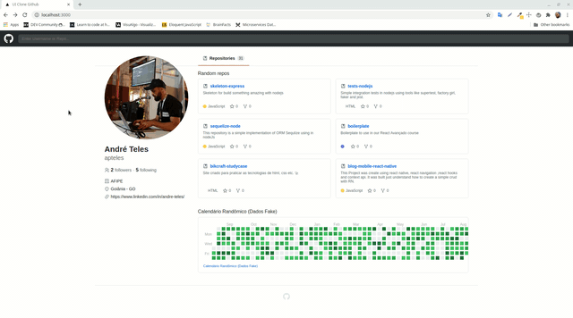

# Github Clone

Clone desenvolvido para aplicar/reforçar conhecimentos em Javascript, ReactJs, Hooks e CSS .

## Preview

# Funcionalidades!

- Consulta a API do github
- Switch Theme (Dark e Light)

# Tecnologias

- Javascript.
- React.
- React Router.
- Styled Components.

# Como executar esse projeto.

1º Clone esse repositório:

`git clone https://github.com/apteles/ui-clone-github.git`

2º Entre na pasta ui-clone-github:

`cd ui-clone-github`

2º Instale as dependências do projeto:

`yarn install`

3º Agora execute o comando para iniciar:

`yarn start`

## Licença

